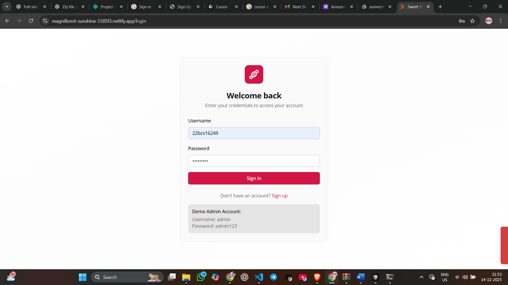

# 📦 AI Kata – Sweet Shop Management System

A backend-focused Sweet Shop Management System built using **Node.js, Express, MongoDB, and TypeScript**, following clean architecture and test-driven development principles.

This project demonstrates authentication, role-based access control, inventory management, and API testing.

---
## 🌐 Live Demo (Frontend)

Netlify URL:  
👉 https://magnificent-sunshine-5505f3.netlify.app/login

> Note: Backend APIs are not deployed. This link demonstrates the UI and authentication flow.

## 🚀 Features

### 🔐 Authentication & Authorization
- User registration & login using JWT
- Password hashing with bcrypt
- Role-based access (`user`, `admin`)
- Protected routes using middleware

### 🍬 Sweet Inventory Management
- Create, update, delete sweets
- Search sweets by name, category, and price range
- Purchase sweets (quantity decreases)
- Prevent purchase when out of stock
- Admin-only restocking
  
## Screenshots
- login page: 
- Dashboard view: 
  
### 🧪 Testing
- Unit tests for business logic & validation
- API integration tests using Supertest
- Jest + TypeScript test setup
- Real MongoDB integration during tests

---

## 🛠 Tech Stack

| Layer | Technology |
|-----|-----------|
| Backend | Node.js, Express |
| Language | TypeScript |
| Database | MongoDB (Mongoose) |
| Auth | JWT, bcrypt |
| Validation | Zod |
| Testing | Jest, Supertest |
| Tooling | tsx, dotenv |

---

## 📁 Project Structure

.
├── server/
├── shared/
├── tests/
├── .env.example
├── jest.config.ts
├── tsconfig.json
└── package.json

---

## ⚙️ Setup & Run

### Clone the repository
## My AI Usage

AI tools were actively and responsibly used throughout the development of this project as part of a modern software development workflow.

### Tools Used
- **ChatGPT** – primary AI assistant
- **Replit AI / Cursor** – occasional code suggestions and refactoring help

### How I Used AI
- Used ChatGPT to **debug complex issues** related to:
  - Jest + TypeScript configuration
  - MongoDB connection handling
  - Windows-specific Node.js environment errors
- Used AI assistance to:
  - Generate **initial boilerplate** for authentication middleware
  - Suggest **API route structures**
  - Draft **unit and integration test patterns**
- All AI-generated code was:
  - Carefully reviewed
  - Manually modified
  - Debugged and tested by me

### My Reflection
Using AI significantly improved my productivity by reducing time spent on repetitive setup and configuration issues.  
However, all architectural decisions, business logic, and final implementations were my own.  
AI acted as an **assistant**, not a replacement, and helped me focus more on correctness, testing, and real-world problem solving.
